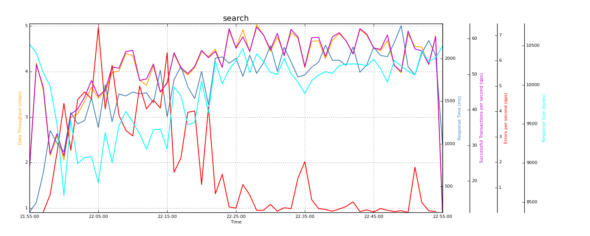
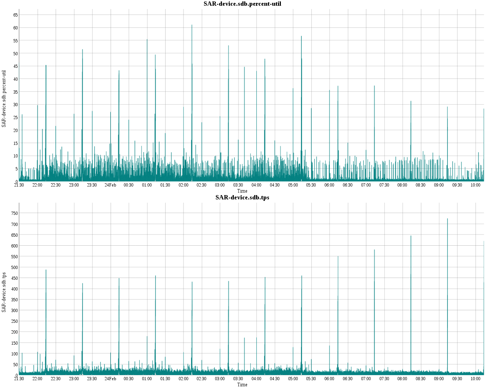
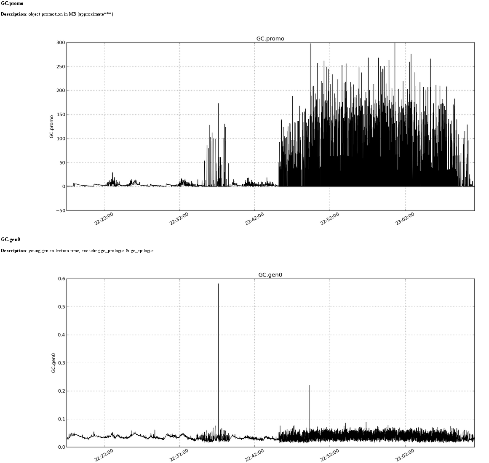

# Naarad #
Naarad is a highly configurable system analysis tool that parses and plots timeseries data for better visual correlation. 
It can be used for performance analysis of your service/application. 
You collect data for the metrics you want to monitor and:

* Naarad parses JVM Garbage Collection (GC), System (SAR), Mysql (Innotop) and Jmeter (JTL/XML) logs
* Naarad reads other metrics you have pre-processed and written in CSV format
* Naarad plots the metrics you specify.

The power of Naarad is in its configurablity. You can use it to glance at various metrics and then choose the important metrics to plot to visually correlate the metrics together. An example use-case is when your application's throughput dropped, you want to know if it was because of some GC activity or a spike in CPU usage or disk I/O. Naarad can help you investigate such issue better.

## Features ##

* Configurable input format, so you can specify which metrics to inspect. GC, SAR and Innotop logs supported currently, with support for more metrics coming in near future. 
* Logs for the supported metrics are parsed by Naarad.
* Also supports generic metric logs in csv format. 
* Pick 'n Choose which metrics to plot together for visual correlation.
* Html report with all the plots for a visual inspection of your application's performance profile.

## How is it different? ##

Many tools and frameworks like Zenoss, rrdtool etc have solved the use-case of metric collection, parsing and plotting. Naarad has an overlap in functionality with these tools, but the main advantage of naarad is in its flexibility, which lets it be a powerful tool for performance investigations. Naarad users are performance experts who need to look for 'needle in a haystack'. Naarad was built to support this use-case. 

## Installation ##

1. Check out Naarad code:

        git clone https://github.com/linkedin/naarad.git

2. Make sure you have python, [pip](http://www.pip-installer.org/en/latest/installing.html) and awk.
3. Install the necessary Python libraries using PIP.

        cd naarad; pip install -r requirements.txt

# Usage #

Naarad needs a config file that lists all the metrics and the graphing options. Example config files can be found in naarad/examples/conf directory. Here is a sample config:

<pre>
[GC]
infile=/home/ritesh/logs/gc.log
gc-options=GC appstop alloc promo used0 used1 used commit0 commit1 commit gen0 gen0t gen0usr gen0sys cmsIM cmsRM cmsRS GC cmsCM
access=local

[SAR-cpuusage]
access=local
infile=/home/ritesh/logs/sar.cpuusage.out
 
[GRAPH]
outdir=/home/ritesh/naarad-out
</pre>

 The config is in INI format with each section describing details about each metric and a special section called GRAPH specifying details about the graphing options.

 Once you have a config describing all your metrics, parsing and plotting needs, just call naarad with the config file as its argument and it should produce all the plots in a basic html report in the outdir specified in config

<pre> naarad config</pre>
 
 Naarad can also take command line arguments: -i or --input_dir and -o or --output_dir. If input_dir is specified, all the infile options in the config are assumed to be relative to input_dir. User can also specify output_dir on command line and skip specifying the outdir option in the config. But if outdir is specified in the config, that takes precedence.

 So you could have a shorter config file:

<pre>
[GC]
infile=gc.log
gc-options=GC appstop alloc promo used0 used1 used commit0 commit1 commit gen0 gen0t gen0usr gen0sys cmsIM cmsRM cmsRS GC cmsCM
access=local

[SAR-cpuusage]
access=local
infile=sar.cpuusage.out

[GRAPH]
graphs=GC.GC,all GC.cmsRM,GC.cmsIM,GC.gen0t GC.promo,GC.alloc
</pre>

And run it as:

<pre> naarad config -i /home/ritesh/logs -o /home/ritesh/naarad-out</pre>

## Templates ##

Naarad comes with pre-built configs that you can use directly for simple cases. The templates are for GC and SAR, and can be used as:

<pre>bin/naarad --i test/data/logs/ -o ~/tmp/naarad template:gc</pre>
<pre>bin/naarad --i test/data/logs/ -o ~/tmp/naarad template:sar</pre>

## User-defined Templates ##

For repeated usage, you can also define your own configs in $HOME/.naarad/templates.txt and use them in command line. The format of templates.txt should be something like this (template name followed by template location):

<pre>template:conf1 http://your-webserver.org/naarad-conf/config1 
template:conf2 http://your-webserver.org/naarad-conf/config2
</pre>

## Calculated metrics ##
Naarad supports basic calculation over a single metric. In particular, it supports calculating rate and diff.

* rate - calculate rate of a metric defined as difference in 2 consecutive data points divided by the time difference. Or, (V[n+1) - V[n])/(T[n+1] - T[n])
* diff - calculate diff if a metric, defined as the difference in 2 consecutive data points. Or, (V[n+1) - V[n])

These metrics can be defined by adding a calc_metrics option in metric definition. Example config:

<pre>[GC]
infile=/home/ritesh/logs/loggc-small
gc-options=alloc promo
access=local
calc_metrics=alloc-rate=rate(alloc) promo-rate=rate(promo) alloc-diff=diff(alloc)
</pre>

# Examples #

Some logs and config files are included in the source code. You can run these commands to try naarad out. 

GC example:

<pre>bin/naarad -i examples/logs/ -o ~/tmp/naarad examples/conf/config-gc</pre>

This generates a results in ~/tmp/naarad. Fire up a browser to view ~/tmp/naarad/Report.html to see all the plots in one place.

SAR example:

<pre>bin/naarad -i test/data/logs/ -o ~/tmp/naarad test/conf/config-sar </pre>

View Results.html in firefox (Chrome complains about cross-domain issues). Note that the sar config specifies plotting graphs using dygraphs.

## Screenshots ##

Here are some example screenshots of reports produced by Naarad:

* Jmeter 
* SAR 
* GC 

# Supported Metrics #

The following metric types are supported currently:

* GC
* Generic metrics in CSV format
* SAR-cpuusage
* SAR-device
* SAR-cpuhz
* SAR-memory
* SAR-memutil
* SAR-paging
* INNOTOP logs

## Generic metric in CSV format ##
You can also define your own metric, say e.g., MYAPP-PERF and write a section with that as long as the infile option points to a csv file. But you need to define the separator character (usually comma) using the option sep. You also need to define all the columns in the csv file with option columns. First column is always assumed to be timestamp, so columns option should specify all options from 2nd column onwards. An example of MYAPP-PERF section could be:

<pre><code>[MYAPP-PERF]
infile=/app/logs/myapplog.csv
access=local
columns=throughput,latency
sep=,

[GRAPH]
graphs=MYAPP-PERF.throughput,MYAPP-PERF.latency
outdir=/home/ritesh/naarad-out
</code></pre>

## Garbage Collection (GC) ##
GC logs are supported using an awk parsing engine called [PrintGCStats](https://java.net/projects/printgcstats/). Supported GC logs should have DateStamps (JVM option `-XX:+PrintGCDateStamps`). 

The following sub-metrics can be specified for GC:

* gen0(s)     - young gen collection time, excluding gc_prologue & gc_epilogue.
* gen0t(s)    - young gen collection time, including gc_prologue & gc_epilogue
* gen0usr(s)  - young gen collection time in cpu user secs
* gen0sys(s)  - young gen collection time in cpu sys secs
* gen1i(s)    - train generation incremental collection
* gen1t(s)    - old generation collection/full GC
* cmsIM(s)    - CMS initial mark pause
* cmsRM(s)    - CMS remark pause
* cmsRS(s)    - CMS resize pause
* GC(s)       - all stop-the-world GC pauses
* cmsCM(s)    - CMS concurrent mark phase
* cmsCP(s)    - CMS concurrent preclean phase
* cmsCS(s)    - CMS concurrent sweep phase
* cmsCR(s)    - CMS concurrent reset phase
* alloc(MB)   - object allocation in MB (approximate***)
* promo(MB)   - object promotion in MB (approximate***)
* used0(MB)   - young gen used memory size (before gc)
* used1(MB)   - old gen used memory size (before gc)
* used(MB)    - heap space used memory size (before gc) (excludes perm gen)
* commit0(MB) - young gen committed memory size (after gc)
* commit1(MB) - old gen committed memory size (after gc)
* commit(MB)  - heap committed memory size (after gc) (excludes perm gen)
* apptime(s)  - amount of time application threads were running
* appstop(s) - amount of time application threads were stalled
* safept(s)   - amount of time the VM spent at safepoints (app threads stopped)

So, e.g., you can specify all GC options using this section:

<pre><code>[GC]
infile=/home/ritesh/logs/gc.log
gc-options=GC alloc promo used0 used1 used commit0 commit1 commit gen0 gen0t gen0usr gen0sys cmsIM cmsRM cmsRS cmsCM cmsCS csmCR apptime safept gen1t gen1i
access=local
</code></pre>

## System metrics using sar ##
Naarad supports various <a href="http://en.wikipedia.org/wiki/Sar_(Unix)">`sar`</a>  metrics, each one as its own metric. Supported metrics and the corresponding command needed to collect them are listed here: 

* SAR-cpuusage using command: `sar -u ALL 1`
* SAR-device using command: `sar -d 1`
* SAR-memory using command: `sar -R 1`
* SAR-memutil using command: `sar -r 1`
* SAR-paging using command: `sar -B 1`
* SAR-swapping using command: `sar -W 1`
